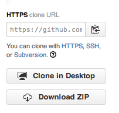

# GitHub


- A service that hosts Git repositories

- Allows you to easily distribute code to others by sharing your repository

- Lets you view your code online easily

- Free to use as long as you make your code public

- Private repositories cost a monthly fee

## Fork

At some point you may find yourself wanting to contribute to someone else's
project, or would like to use someone's project as the starting point for your
own. This is known as "forking".

To fork someone's repository, you can used the clone command like so:

```
~> git clone https://github.com/supercooluser/supercoolproject.git
```

Once you clone someone's repository, the clone's remote will be still be
pointing to the original repository.

```
~> git remote -v
origin https://github.com/supercooluser/supercoolproject.git
```

You can leave this configuration as it is if you want to commit your changes
to that original repository. If you want to have the clone in your own GitHub,
go to the GitHub site, create a new repository, copy its HTTPS clone URL which
you will find on the right-hand side of the repository's main page.


