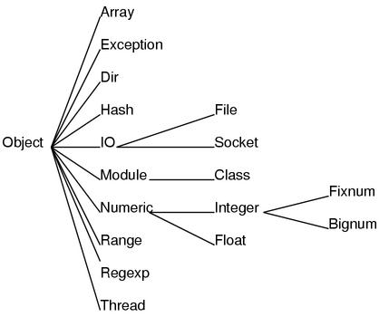

# Classes



```ruby
class Car
	attr_accessor :make

	def initialize(make)
		@make = make
	end

	def start
		# Code to start engine
	end

	def drive
		# Code to drive car
	end

	def brake
		# Code to apply brakes
	end

	private
	def open_doors
		# Code to open doors
	end
end
```

In object-oriented programming languages, structuring your application involves 
the use of classes and objects to encapsulate related code into reusable and
extendable componenets. A class is the blueprint from which individual objects 
are created.

Classes are used to hold related values and methods that you will want to reuse 
all together. For instance, using the above Car class, you can define new cars 
like so:

```ruby
irb(main)> bmw = Car.new('BMW')
irb(main)> bmw.make
=> 'BMW'
```

Now, you will have a new instance of the Car class whose make value is set to 
`'BMW'`.

## Initialize
```ruby
def initialize(name, age, gender)
	@name = name
	@age = age
	@gender = gender
end
```

The `initialize` method of class is executed when a new instance of the class 
is created. The parameters of this method, when coupled with variable 
definitions as seen above, will set those values of the new class instance.

Utilizing the initialize function allows you to create the ``bmw`` instance 
that was created above like so:

```ruby
bmw = Car.new('BMW')
```

Another thing you can do with classes is create a new class that extends from 
it, like so:

```ruby
class BMW < Car
	attr_accessor :model, :year, :horsepower, :num_of_doors
end
```

Now, you will have a new class from which you can create new instances.

```ruby
m_three = BMW.new('M3', 2014, 500, 2)
```

Executing the above code with assign to the variable ``m_three`` an instance of 
the BMW class with its ``model`` set to ``'M3'``, its ``year`` set to ``2014``, 
its ``horsepower`` set to ``500``, and its ``num_of_doors`` set to ``2``.


## attr_accessor

`attr_accessor` is used to define which values and methods of the class will be 
publicly accessible. If you do not include an attribute or method in the 
attr_accessor list, it will only be available to other methods within the class.

## Class Variables
Ruby provides four types of variables:

* **Local Variables:** Local variables are the variables that are defined in a 
method. Local variables are not available outside the method. You will see more 
details about method in subsequent chapter. Local variables begin with a 
lowercase letter or _.

* **Instance Variables:** Instance variables are available across methods for 
any particular instance or object. That means that instance variables change 
from object to object. Instance variables are preceded by the at sign (@) 
followed by the variable name.

* **Class Variables:** Class variables are available across different objects. 
A class variable belongs to the class and is a characteristic of a class. They 
are preceded by the sign @@ and are followed by the variable name.

* **Global Variables:** Class variables are not available across classes. If 
you want to have a single variable, which is available across classes, you need 
to define a global variable. The global variables are always preceded by the 
dollar sign ($).
